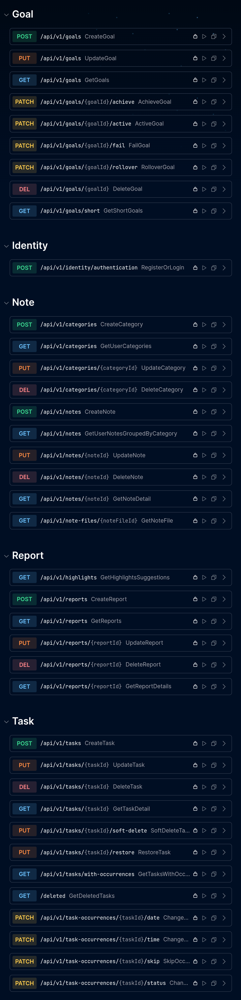

# SamarPlanner

A modular personal productivity app built with the .NET ecosystem.

SamarPlanner helps manage daily tasks, goals, notes, and periodic reports — all in one place.

> Built as a learning-focused portfolio project with production-minded architecture.

🌐 [samarpln.ir](https://samarpln.ir) · 📡 [API Docs](https://api.samarpln.ir/scalar) · 🖥️ [Web App](https://app.samarpln.ir)


## Preview

<p align="center">
  <picture>
    <!-- برای گوشی‌ها (عرض صفحه کمتر از 768 پیکسل) -->
    <source media="(max-width: 767px)" srcset="./docs/images/landing.png" width="90%">
    <!-- برای کامپیوتر (عرض صفحه بیشتر یا مساوی 768 پیکسل) -->
    <source media="(min-width: 768px)" srcset="./docs/images/landing.png" width="50%">
    <!-- اگر مرورگر تگ <picture> رو پشتیبانی نکنه، این یکی جایگزین میشه -->
    
  </picture>
  <picture>
    <source media="(max-width: 767px)" srcset="./docs/images/scalar.png" width="90%">
    <source media="(min-width: 768px)" srcset="./docs/images/scalar.png" width="50%">
    
  </picture>
</p>

## Modules

- **Identity** – authentication and JWT-based authorization
- **Task** – task management and recurring task occurrences
- **Goal** – goal planning and status tracking
- **Note** – notes, categories, and file attachments
- **Report** – periodic reports and highlights


## Tech Stack

**Backend:** ASP.NET Core · Entity Framework Core · MediatR · FluentValidation · Serilog  
**Auth:** ASP.NET Identity · JWT  
**Clients:** Blazor · .NET MAUI  
**Testing:** xUnit · FluentAssertions · NSubstitute · WebApplicationFactory  
**Infrastructure:** SQL Server · Docker


## Architecture

SamarPlanner is organized as a **modular monolith** with DDD-inspired layered design.

Each module follows this structure:

```text
Module
├── Core             → Entities, domain rules
├── Application      → Use cases, commands, queries, validators
├── Infrastructure   → Persistence, repositories, services
└── API              → Controllers, contracts
```

Shared building blocks:

- `Shared.Kernel` → Result types, settings
- `Shared.Contracts` → Commands, queries, enums, DTOs
- `Shared.Application` → MediatR behaviors
- `Shared.Infrastructure` → Base DbContext, migrations


## Testing Strategy

Multiple levels of automated testing:

| Level           | What it tests                          | Tools                    |
|-----------------|----------------------------------------|--------------------------|
| **Unit**        | Domain logic, handlers, validators     | xUnit, FluentAssertions  |
| **Integration** | Module pipeline with real DI           | WebApplicationFactory    |
| **API / E2E**   | Full HTTP request/response             | HttpClient, InMemory DB  |

```bash
dotnet test
```


## Getting Started

### With Docker (recommended)

```bash
git clone https://github.com/YOUR_USERNAME/SamarPlanner.git
cd SamarPlanner
docker compose up
```

API will be available at `http://localhost:5009`  
API docs at `http://localhost:5009/scalar`

### Without Docker

**Prerequisites:** .NET SDK, SQL Server

```bash
git clone https://github.com/YOUR_USERNAME/SamarPlanner.git
cd SamarPlanner
dotnet restore
```

Update connection strings in:

```text
src/SamarPlanner.Api/appsettings.json
```

Then:

```bash
dotnet run --project src/SamarPlanner.Api
```


## Contributing

Contributions and feedback are welcome.

1. Fork the repository
2. Create a feature branch
3. Make your changes
4. Open a pull request


## Author

**Alireza Haeri**
- GitHub: [alireza-haeri](https://github.com/alireza-haeri)
- Telegram: [AlirezaHaeriDev](https://telegram.me/AliRezaHaeriDev)
- Linkedin: [alireza-haeri-dev](http://linkedin.com/in/alireza-haeri-dev)